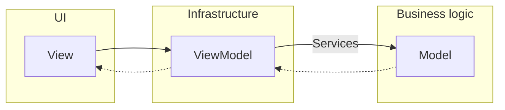
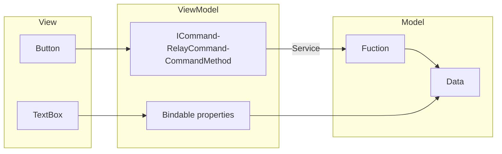

```mermaid

flowchart LR

subgraph UI

V[View]

end

subgraph Infrastructure	
	
	VM[ViewModel]	

end

subgraph Business logic

M[Model]

end

 V --> VM -->|Services|M
 M -.-> VM
 VM -.-> V
 
```

### Concrete objects

```mermaid

flowchart LR

subgraph ViewModel

	RCIC[ICommand-RelayCommand-CommandMethod]
	BP[Bindable properties]

end

subgraph View

B[Button]
TB[TextBox]

end

subgraph Model
	M[Fuction]
	D[Data]
end

B --> RCIC -->|Service| M --> D
TB --> BP --> D

```